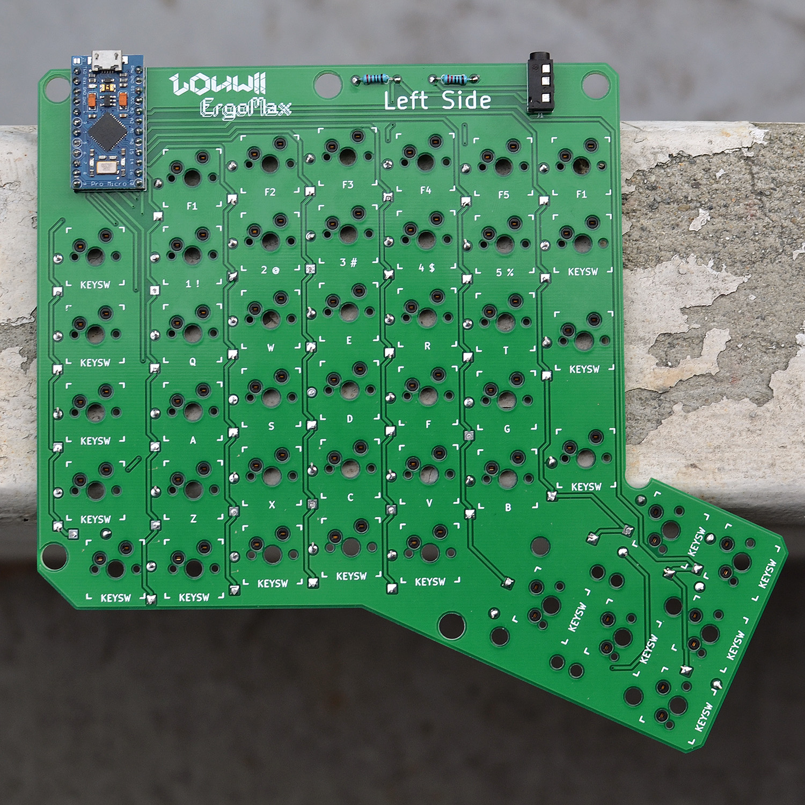
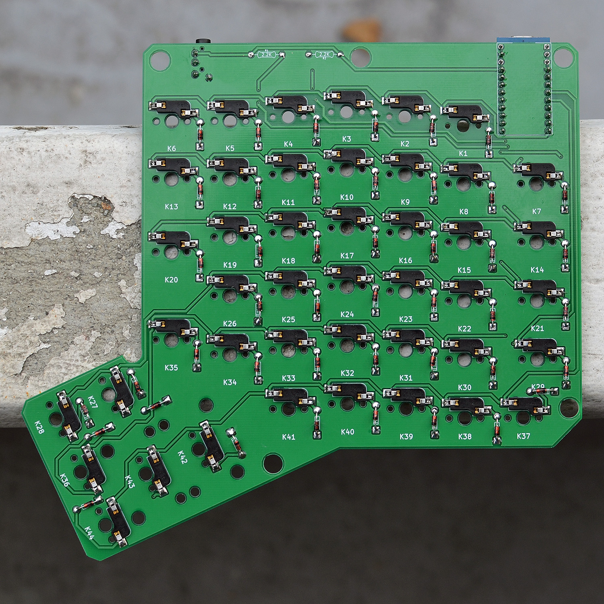
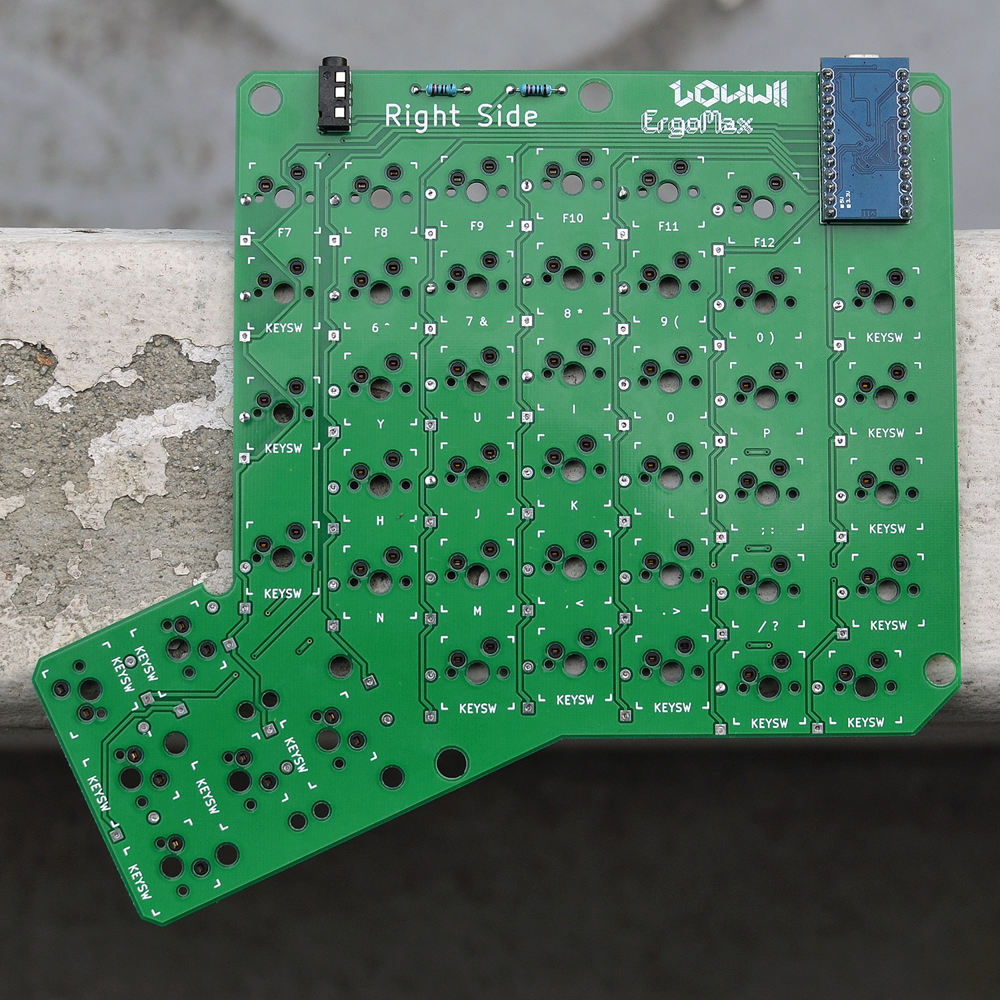
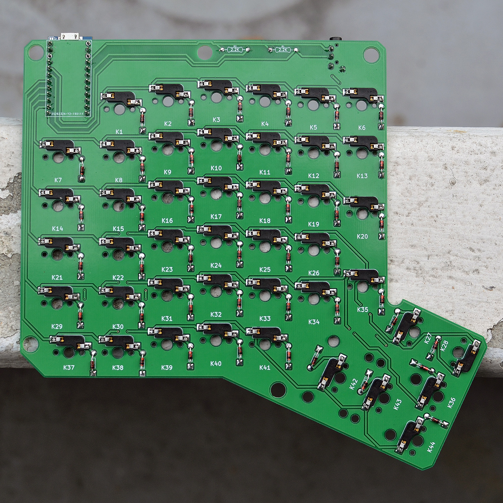

# Assembly

Here comes the fun part!

## Parts list

Make sure you have everything, check the [BOM](BOM.md)

## Process

First, make sure you understand on which side of the PCB you're supposed to solder/place the component on. This is easy for the left/right PCBs, a bit harder for the reversible PCB version.

The top of the PCB is where the switches will be on. On that side, we'll also have the ProMicro, 3.5mm jack connector, the 2 resistors and the 2 stabilizers.

On the bottom of the PCB, we'll have the 44 Kailh sockets and the 44 diodes.

**Note:** The 2 resistors can probably be soldered on the back, if you want to.

To give you an idea, here are the assembled PCBs.

### Left Side

#### Front

#### Back

### Right Side

#### Front

#### Back

### Step by step

#### Inserting Kailh sockets

The sockets fit very tightly on the PCB, maybe a bit too tight as they can be hard to put them in place. The good news is: this will prevent them from getting pulled off of the PCB when inserting a switch.

I recommend using a flat piece of wood to evenly put pressure on the socket until it sits flush with the PCB. You might need to put some good force on it. Make sure the socket is really flush with the PCB, otherwise it'll be harder to solder the socket later on.

I know, this isn't really fun. But take your time, don't rush, you might end up with a broken socket or worse.

#### Soldering the diodes

#### Soldering the resistors

#### Soldering the jack connector

#### Testing the ProMicro

Before soldering the ProMicro on the PCB, I advise you to test it. If, for some reason, the ProMicro doesn't work, it'll be a pain to remove.

Get a micro-USB cable, and flash a firmware on it.

#### Soldering the ProMicro

We're almost there! The hardest part left, the ProMicro.

The goal is not to mess it up and not bridge 2 pins. Take your time, do this in a well lit place (use your phone as a flashlight if needed). The pins and holes/pads are small and don't require a lot of solder. Heat up the pad an pin and place a small amount of solder. If you're having issues, a bit of flux might help.

Once done, make sure your solders are clean and that there are no bridges at all (2 pins or pads touching because you put too much solder on).