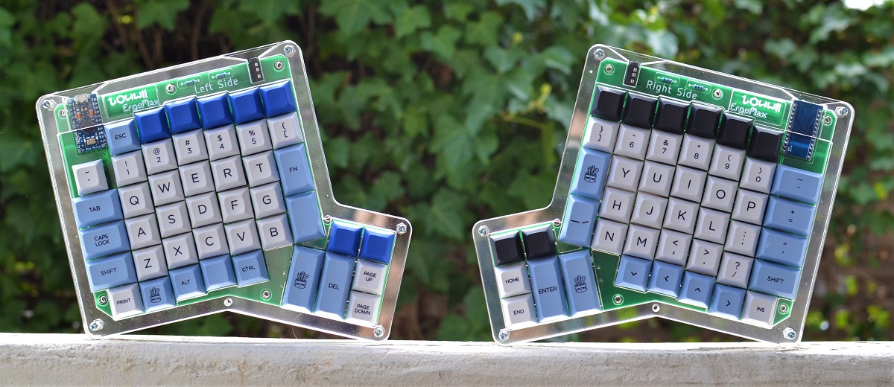

# ErgoMax

The ErgoMax is a split ergonomic keyboard.

It is based on the ErgoDox, a popular split ergonomic keyboard ([learn more](https://www.ergodox.io/)). 

Its main features/differences are:

* extra top row for F1-F12 keys
* hot-swappable switches
* uses 2 ProMicro controllers (one for each side)
* QMK firmware
* 2 versions of the PCBs:
    * a reversible left+right combined
    * 2 separate PCBs, one for each side
* either side can be master/slave
* both sides can be master (both sides need to be connected via USB in that case), allow for a 1 side only setup
* 2 input pins left (perfect for a rotary encoder!)
* **DIY friendly**: it's really super easy to assemble yourself. The hardest part is probably the ProMicro. But it's still very accessible for beginners.
* multi layer acrylic case

## Layout

While a lot of mechanical keyboard users seem to prefer simplistic, minimal keyboards, the ErgoMax goes the opposite way.

The layout is the same as the ErgoDox, **with an extra top row** for *F1* to *F12* keys, adding more room for activities.

Here's an example:

## Hotswap - change switches whenever you want

The keyboard PCB has been designed to use **Kailh MX hotswap sockets**. You won't be able to solder the switches directly on the PCBs, you **must** use Kaihl MX sockets.

Switches will plug into the sockets, meaning no solder required for them, and most importantly, meaning that you can remove them and change them easily (hence the *hotswap*...).

## Controller

Each side of the keyboard is controlled via a ProMicro, which is a cheap, small Arduino compatible board running on an ATmega32u4.

The 2 sides can be connected via a 3.5mm jack, just like the original ErgoDox. However, as the 2 sides possess their own ProMicro, that means they can also be working totally independently if needed.

There are 2 pins free on each of the ProMicros, which can be used for whatever you want. I believe it would be possible to drive a RGB strip from it, since it requires only 1 drive pin (you would need to get GND and +5V from somewhere on the PCB). I was able to use both pins to add a rotary encoder.

### Jack connector

I tried to use the same 3.5mm TRRS jack socket as the original ErgoDox, which is a *CP-43514*. But it's not super common, so I changed it for a *PJ320A* (same as *MJ-4PP-9*).

### Firmware

Check the [guides](Guide/README.md)

## Third Party Libraries

We are using several libraries in this project.

* keyboard_parts.pretty [https://github.com/colemarkham/keyboard_parts.pretty](https://github.com/colemarkham/keyboard_parts.pretty) - The Kailh hotswap socket footprint is taken from this project, and has been slightly modified. The 2U stabilizer footprint is from this library as well.
* ProMicroKiCad [https://github.com/Biacco42/ProMicroKiCad](https://github.com/Biacco42/ProMicroKiCad) - The schema and footprint for the ProMicro
* Keebio-Parts.pretty [https://github.com/keebio/Keebio-Parts.pretty](https://github.com/keebio/Keebio-Parts.pretty) - Footprints for the diodes, the PJ320A jack connector, and resistors

### 3D models

Kicad can generate nice 3D previews of PCBs and their components.

As we're using components that are not included in KiCad 3d templates, you'll need to add the next models into your KiCad template folder. On Windows, it's `C:\Users\YOURNAME\kicad\template`, on OSX it's `/Users/YOURNAME/kicad/template`. If the folder doesn't exist, create it.

The 3D models of the hotswap sockets can be found there: [https://github.com/qmk/qmk_hardware](https://github.com/qmk/qmk_hardware). Copy `kailh_socket_mx.stp` into your KiCad template folder.

I couldn't find a 3D model for the PJ320A jack connector. The closest I found is this [https://www.cui.com/product/resource/3dmodel/sj2-3574a-smt-tr](https://www.cui.com/product/resource/3dmodel/sj2-3574a-smt-tr), which gives a good preview of a real PJ320A. Copy `CUI_SJ2-3574A-SMT-TR.step` into your KiCad template folder.

I modified this MX Switch 3D model [https://grabcad.com/library/cherry-mx-switches-mx-1](https://grabcad.com/library/cherry-mx-switches-mx-1) and included it in the `libs/3dmodels` folder of the project as `MX-clean-ergomax.step`. 

I also modified a 2U stabilizer model that I found there [https://grabcad.com/library/cherry-mx-stabilizer-mx-1](https://grabcad.com/library/cherry-mx-stabilizer-mx-1). The file is also included in the `libs/3dmodels` folder of the project as `Stabilizer-closed-ergomax.step`.

I once again modified a ProMicro 3D model [https://grabcad.com/library/arduino-pro-micro-1](https://grabcad.com/library/arduino-pro-micro-1). The file is called `Pro-micro-clean-ergomax.step` and is stored in `libs/3dmodels`.

## Print the PCBs

Here are some manufacturers that can print PCBs for you. They are not in any particular order and I don't have any partnership of any sort either.

* [https://pcbshopper.com/ - price comparison](https://pcbshopper.com/) 
* [https://jlcpcb.com/](https://jlcpcb.com/)
* [https://www.pcbway.com/](https://www.pcbway.com/)
* [https://oshpark.com/](https://oshpark.com/)
* [https://www.pcbcart.com/](https://www.pcbcart.com/)
* [https://www.7pcb.ca/](https://www.7pcb.ca/pcb-fabrication/)
* [https://www.4pcb.com/](https://www.4pcb.com/)
* [https://www.pcbgogo.com/](https://www.pcbgogo.com/)
* [https://dirtypcbs.com/](https://dirtypcbs.com/)

## Assembly

Check the [guides](Guide/README.md)

## Case

[See Case readme](./Case/README.md)